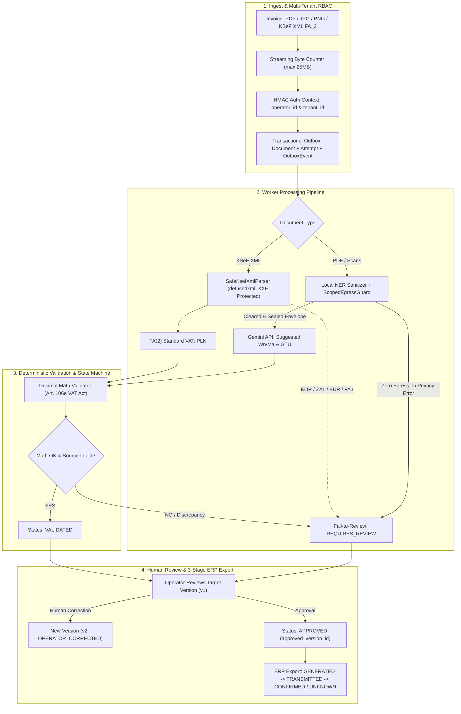

# KARIK – Hybrid Accounting & Tax Law RAG System (Polish Jurisdiction)

[](https://www.python.org/)
[](https://fastapi.tiangolo.com)
[](https://docs.celeryq.dev/)
[](https://github.com/pgvector/pgvector)
[](https://docs.pytest.org/)
[](https://isap.sejm.gov.pl/)
[](LICENSE)

> 🇵🇱 **Dedicated to the Polish Tax & Accounting Legal System**: Purpose-built for the Polish jurisdiction, compliant with Polish GAAP (*Ustawa o Rachunkowości*), corporate & personal income taxes (CIT / PIT), goods and services tax (VAT), social security system (ZUS), the Polish Tax Code (*Ordynacja Podatkowa*), and native deterministic parsing of the Polish National e-Invoicing System (**KSeF XML FA(2)**).

An asynchronous, production-grade hybrid accounting document processing system (PDF, PNG, JPEG, KSeF XML) combining a **Fail-Closed Privacy Layer with Scoped Egress Guard**, **Transactional Outbox & Attempt Leasing**, **Deterministic Financial Math Validation (Art. 106e VAT Act)**, and an **Advanced RAG Engine for Polish statutory legislation**.

---

## 📐 System Architecture



---

## 🛠️ Technology Stack

| Layer | Technologies | Role & Purpose |
| :--- | :--- | :--- |
| **API & Gateway** | FastAPI, Uvicorn, Pydantic v2 | Multi-tenant RBAC, streaming byte-counting upload (25 MB max), and REST endpoints |
| **Persistence & Outbox** | PostgreSQL 16 (`pgvector`), Transactional Outbox | Single source of truth for documents, attempts, extraction versions, and audit trails |
| **Task Queue & Broker** | Celery, Redis (transient RAM-only broker) | Background processing with atomic attempt claiming (`lease_token` fencing) |
| **KSeF XML Engine** | `defusedxml`, `lxml` (XXE & DTD safe) | 100% deterministic parsing of KSeF FA(2) standard VAT invoices |
| **Financial Math Engine** | Python `Decimal` (`ROUND_HALF_UP`) | Strict Polish VAT Act validation (Art. 106e: tax base sum vs line items sum, Modulo 11 NIP) |
| **Privacy & Egress Guard** | Microsoft Presidio, spaCy (`pl_core_news_lg`), `ScopedEgressGuard` | Scoped fail-closed cloud egress guard guaranteeing 0 external calls on privacy failure |
| **Vector DB & RAG** | PostgreSQL 16 with `pgvector` (HNSW) + Full-Text Search (`tsvector`) | Hybrid retrieval across Polish statutory acts with Reciprocal Rank Fusion (RRF $k=60$) |
| **NLP Models (SOTA Polish)** | `sdadas/mmlw-e5-base` (Embeddings), `sdadas/polish-reranker-roberta-v3` (Reranker) | Semantic search and legal document re-ranking with Sigmoid normalization |
| **Cloud LLM** | Google Gemini API (`google.genai`), Context Caching | Suggested account classification (Wn/Ma, GTU) without amount mutation permissions |
| **Testing & UI** | Pytest (**38 tests passed**), Streamlit, HTML5/JS UI | Unit, integration, security, and idempotency test suites |

---

## 🔑 Key Engineering Guarantees

### 1. Separation of Document State vs. AI Suggestions
* **No `VERIFIED` Ambiguity**: Replaced with an explicit state machine: `RECEIVED` $\rightarrow$ `EXTRACTED` $\rightarrow$ `VALIDATED` $\rightarrow$ `REQUIRES_REVIEW` $\rightarrow$ `APPROVED` / `REJECTED`.
* **Immutable Source Data**: Core invoice data (amounts, items, counterparties, issue dates) is extracted deterministically from KSeF XML or OCR. The LLM cannot alter or proportionally rescale invoice amounts; AI output only populates `AISuggestions` (suggested Wn/Ma accounts, GTU codes, tax notes).
* **Human-in-the-Loop Corrections**: When an operator corrects an OCR reading, it creates a new extraction version (`v2`, `source_type: OPERATOR_CORRECTED`) linked to `parent_version_id`. The document's `approved_version_id` controls ERP export.

### 2. Deterministic Financial Math Engine (Art. 106e VAT Act)
* **Zero Arbitrary Tolerance**: Calculations use strictly `Decimal` with `ROUND_HALF_UP` to the penny.
* **Dual Statutory VAT Calculation Rules**: In accordance with Art. 106e ust. 10 of the Polish VAT Act, tax group summaries are validated against both legally admissible methods:
  1. Method 1: Tax calculated on the sum of net values per rate ($\sum Netto_{group} \times Rate$).
  2. Method 2: Tax calculated as the sum of tax values from individual invoice line items ($\sum Tax_{items}$).
  Declared VAT amounts must match Method 1 OR Method 2. Discrepancies generate specific reconciliation errors.
* **Polish NIP Modulo 11**: Algorithmic check-digit verification with weights $[6, 5, 7, 2, 3, 4, 5, 6, 7]$, rejecting invalid and all-zero numbers.

### 3. Transactional Outbox & Worker Fencing
* **Atomicity**: Document upload, initial processing attempt (`PENDING`), and `OutboxEvent` are written in a single database transaction.
* **Idempotency & Concurrency Fencing**: Workers atomically claim processing attempts via conditional update (`UPDATE processing_attempts SET status='RUNNING', lease_token=:uuid WHERE status='PENDING' RETURNING lease_token`). Subsequent writes are fenced by `lease_token`, preventing stale workers from overwriting new state.

### 4. Scoped Fail-Closed Cloud Egress Guard
* **Cryptographic Payload Sealing**: The local privacy engine packages sanitized text into an immutable `SanitizedPayloadEnvelope` containing a SHA-256 hash.
* **Zero External Egress on Privacy Error**: If local NER fails or unreplaced PII tokens are detected, the egress guard blocks cloud calls immediately (guaranteeing 0 outbound HTTP/gRPC requests in tests).

### 5. 3-Stage ERP Export with Network Timeout Safety
* **Lifecycle Events**: `EXPORT_GENERATED` $\rightarrow$ `EXPORT_TRANSMITTED` $\rightarrow$ `EXPORT_CONFIRMED`.
* **Handling Network Interruptions (`EXPORT_UNKNOWN`)**: If the connection drops before receiving an acknowledgment from the ERP system, the state transitions to `EXPORT_UNKNOWN`. Automatic retries are prevented until the state is verified via a deterministic `idempotency_key = sha256(doc_id + version_id + erp_system)`.

---

## 📊 RAG Benchmark Metrics (Polish Tax Law)

Quality evaluation benchmarks measured on a dataset of 15 complex Polish tax law scenarios ([`eval_results.json`](eval_results.json)):

* **Citation Accuracy**: Evaluated with strict `(act, article_number, suffix)` tuple matching (normalizing references so that e.g. Art. 2 does not falsely match Art. 28b or Art. 2a).
* **Retrieval Hit Rate @ 1**: **73.3%**
* **Retrieval Hit Rate @ 3**: **73.3%**
* **MRR (Mean Reciprocal Rank)**: **0.733**
* **Lexical Similarity Heuristic**: **66.2%** (measuring reference claim token coverage; distinct from semantic entailment).
* **Semantic Entailment Verification**: Penalizes direct semantic contradictions and negations (e.g. "podatnik może odliczyć" vs "podatnik nie może odliczyć").

---

## 📁 Project Structure

```text
KARIK/
├── accounting/                 # Core accounting domain & lifecycle package
│   ├── auth.py                 # Multi-tenant RBAC & session token verification
│   ├── db.py                   # Transactional Outbox repository & attempt leasing
│   ├── models.py               # Pydantic schemas: Document, Version, SourceData, Suggestions
│   └── storage.py              # Streaming upload byte counter (25MB) & durable archive
├── validators/                 # Financial math & regulatory validation
│   ├── invoice_math.py         # Decimal VAT engine (Art. 106e) & Modulo 11 NIP check
├── security/                   # Zero-trust privacy & egress control
│   ├── egress_guard.py         # Scoped Cloud Egress Guard & sealed envelope verification
├── ksef_parser.py              # Native KSeF XML FA(2) parser with defusedxml XXE protection
├── main.py                     # FastAPI Gateway & authenticated REST endpoints
├── tasks.py                    # Celery Worker with attempt leasing & safe pipeline
├── pii_sanitizer.py            # Presidio + Polish NIP/PESEL/REGON/IBAN validators + Gemma SLM
├── eval_rag.py                 # RAG evaluation benchmark suite for Polish tax law
├── rag/                        # Advanced RAG core package (HNSW + FTS RRF)
└── tests/                      # Automated Pytest suite (50 passed tests)
    ├── test_stage1_contracts.py        # 7 contracts: no zero/dummy fallbacks, 503 unavail ERP, 409 conflict, RBAC
    ├── test_multiprocess_persistence.py# 5 multi-process persistence, race condition & Postgres config tests
    ├── test_audit_critical_cases.py    # 6 critical audit test cases (idempotency, outbox, tenant isolation)
    ├── test_ksef_and_decimal_math.py   # Decimal VAT math, KSeF FA(2), XXE, statutory article matching
    ├── test_security_and_eval.py       # Streaming upload limits & 3-stage ERP export
    ├── test_gateway.py                 # FastAPI endpoints & multi-tenant auth
    ├── test_pipeline.py                # End-to-end pipeline execution & original file retention
    └── test_sanitizer.py               # Presidio PII masking & checksum validation
```

---

## 🧪 Automated Testing

Execute the complete 50-test Pytest unit, integration, and security suite:
```bash
.\.venv\Scripts\python.exe -m pytest tests/ -v
```

Execute the Polish tax law RAG evaluation benchmark:
```bash
.\.venv\Scripts\python.exe eval_rag.py
```

---

## 📄 License

This project is distributed under the **Source-Available (Portfolio Review Only)** license. The source code is publicly accessible for evaluation, educational, and recruitment review purposes only. See [LICENSE](LICENSE) for details.
