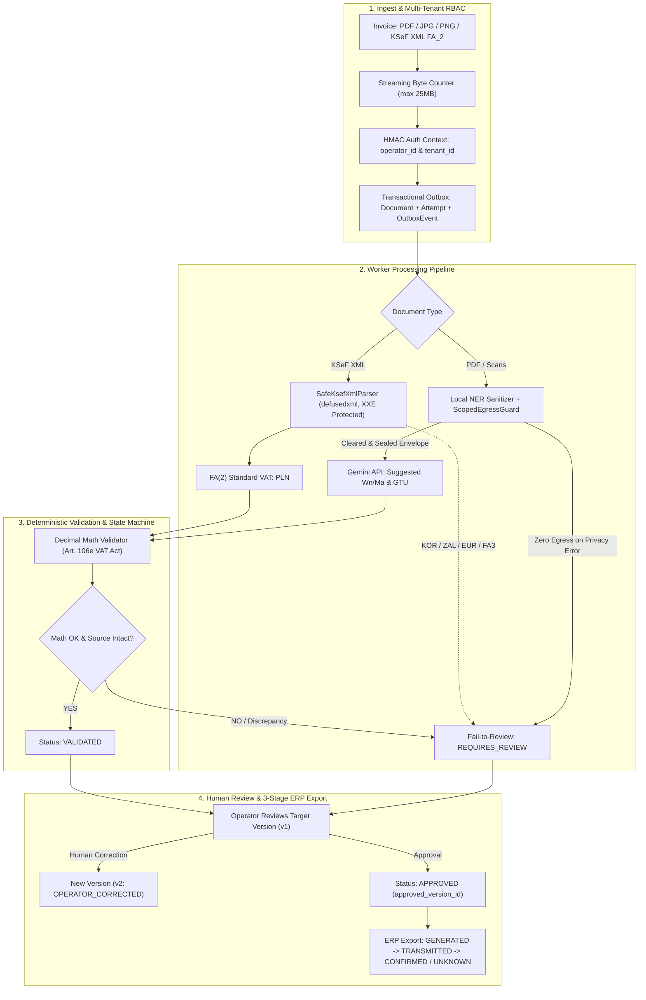

# KARIK – Hybrid Accounting & Tax Law RAG System (Polish Jurisdiction)

[](https://www.python.org/)
[](https://fastapi.tiangolo.com)
[](https://docs.celeryq.dev/)
[](https://github.com/pgvector/pgvector)
[](https://github.com/hrabiabarykent/karik-accounting-rag/actions/workflows/ci.yml)
[](https://isap.sejm.gov.pl/)
[](LICENSE)

> 🇵🇱 **Dedicated to Polish Tax & Accounting Legal System**: Designed around selected Polish accounting and tax-law requirements, including Polish GAAP (*Ustawa o rachunkowości*), corporate & personal income taxes (CIT / PIT), goods and services tax (VAT), the social security system (ZUS), the Polish Tax Code (*Ordynacja podatkowa*), and native deterministic parsing of the Polish National e-Invoicing System (**KSeF XML FA(2)**).

An asynchronous, production-oriented portfolio system featuring a production-inspired architecture with tested reliability and security mechanisms for hybrid accounting document processing (PDF, PNG, JPEG, KSeF XML). The system combines a **Fail-Closed Privacy Layer with Scoped Egress Guard**, **Transactional Outbox & Worker Attempt Leasing**, **Deterministic Financial Math Validation (Art. 106e VAT Act)**, and an **Advanced Hybrid RAG Engine for Polish statutory legislation**.

> [!WARNING]
> **Legal & Tax Disclaimer**: This project is an engineering and portfolio demonstration. It does not constitute certified legal, tax, or accounting advice, nor does it guarantee exhaustive statutory compliance for live enterprise reporting.

---

## 🚀 Quick Start

Get the system running locally in minutes:

### 1. Prerequisites
- **Python**: 3.12+
- **Container Runtime**: Docker Desktop (with Compose v2)
- **Hardware Recommendations**:
  - *Core / Cloud stack*: $\ge$ 8 GB RAM, standard x86_64 CPU.
  - *Local ML stack (`all-local`)*: $\ge$ 16 GB RAM and an NVIDIA GPU with $\ge$ 6 GB VRAM (CUDA support for local Gemma SLM).
- **Offline Polish NLP Models**: Downloaded via `python scripts/download_models.py` (or mounted via Docker volumes).
- **Gemini Cloud Mode**: Requires a valid `GEMINI_API_KEY` configured in `.env`.
- **Database Migrations**: Applied automatically on startup via `database/migrations/`.

### 2. Setup & Run

```bash
# 1. Clone repository
git clone https://github.com/hrabiabarykent/karik-accounting-rag.git
cd karik-accounting-rag

# 2. Configure environment variables
copy .env.example .env     # On Windows (or: cp .env.example .env on Linux/macOS)
# IMPORTANT: Edit .env and set KARIK_AUTH_SECRET (minimum 32 characters required)

# 3. Start complete local stack with Docker
docker compose --profile all-local up -d --build

# 4. Run automated test suite
python -m pytest tests/ -v
```

---

## 📐 System Architecture



---

## 🛠️ Technology Stack

| Layer | Technologies | Role & Purpose |
| :--- | :--- | :--- |
| **API & Gateway** | FastAPI, Uvicorn, Pydantic v2 | Multi-tenant RBAC, streaming byte-counting upload (25 MB max), and REST endpoints |
| **Persistence & Outbox** | PostgreSQL 16 (`pgvector`), Transactional Outbox | Single source of truth for documents, attempts, extraction versions, and audit trails |
| **Task Queue & Broker** | Celery, Redis (transient RAM-only broker) | Background processing with atomic attempt claiming (`lease_token` fencing) |
| **KSeF XML Engine** | `defusedxml`, `lxml` (XXE & DTD safe) | 100% deterministic parsing of KSeF FA(2) standard VAT invoices |
| **Financial Math Engine** | Python `Decimal` (`ROUND_HALF_UP`) | Strict Polish VAT Act validation (Art. 106e: tax base sum vs line items sum, Modulo 11 NIP) |
| **Privacy & Egress Guard** | Microsoft Presidio, spaCy (`pl_core_news_lg`), `ScopedEgressGuard` | Scoped fail-closed cloud egress guard guaranteeing 0 external calls on privacy failure |
| **Vector DB & RAG** | PostgreSQL 16 with `pgvector` (HNSW) + Full-Text Search (`tsvector`) | Hybrid retrieval across Polish statutory acts with Reciprocal Rank Fusion (RRF $k=60$) |
| **Polish NLP Models** | `sdadas/mmlw-e5-base` (Embeddings), `sdadas/polish-reranker-roberta-v3` (Reranker) | Semantic search and legal document re-ranking with Sigmoid normalization |
| **Cloud LLM** | Google Gemini API (`google.genai`), Context Caching | Suggested account classification (Wn/Ma, GTU) without amount mutation permissions |
| **Testing & UI** | Pytest (137 passed tests), Streamlit, HTML5/JS UI | Comprehensive unit, integration, security, and idempotency test suites |

---

## 🔑 Key Engineering Guarantees

### 1. Separation of Document State vs. AI Suggestions
* **No `VERIFIED` Ambiguity**: Replaced with an explicit state machine: `RECEIVED` $\rightarrow$ `EXTRACTED` $\rightarrow$ `VALIDATED` $\rightarrow$ `REQUIRES_REVIEW` $\rightarrow$ `APPROVED` / `REJECTED`.
* **Immutable Source Data**: Core invoice data (amounts, items, counterparties, issue dates) is extracted deterministically from KSeF XML or OCR. The LLM cannot alter or proportionally rescale invoice amounts; AI output only populates `AISuggestions` (suggested Wn/Ma accounts, GTU codes, tax notes).
* **Human-in-the-Loop Corrections**: When an operator corrects an OCR reading, it creates a new extraction version (`v2`, `source_type: OPERATOR_CORRECTED`) linked to `parent_version_id`. The document's `approved_version_id` controls ERP export.

### 2. Deterministic Financial Math Engine (Art. 106e VAT Act)
* **Zero Arbitrary Tolerance**: Calculations use strictly `Decimal` with `ROUND_HALF_UP` to the penny.
* **Dual Statutory VAT Calculation Rules**: In accordance with Art. 106e ust. 10 of the Polish VAT Act, tax group summaries are validated against both legally admissible methods:
  1. Method 1: Tax calculated on the sum of net values per rate ($\sum Netto_{group} \times Rate$).
  2. Method 2: Tax calculated as the sum of tax values from individual invoice line items ($\sum Tax_{items}$).
  Declared VAT amounts must match Method 1 OR Method 2. Discrepancies generate specific reconciliation errors.
* **Polish NIP Modulo 11**: Algorithmic check-digit verification with weights $[6, 5, 7, 2, 3, 4, 5, 6, 7]$, rejecting invalid and all-zero numbers.

### 3. Transactional Outbox & Worker Fencing
* **Atomicity**: Document upload, initial processing attempt (`PENDING`), and `OutboxEvent` are written in a single database transaction.
* **Idempotency & Concurrency Fencing**: Workers atomically claim processing attempts via conditional update (`UPDATE processing_attempts SET status='RUNNING', lease_token=:uuid WHERE status='PENDING' RETURNING lease_token`). Subsequent writes are fenced by `lease_token`, preventing stale workers from overwriting new state.

### 4. Scoped Fail-Closed Cloud Egress Guard
* **Cryptographic Payload Sealing**: The local privacy engine packages sanitized text into an immutable `SanitizedPayloadEnvelope` containing a SHA-256 hash.
* **Zero External Egress on Privacy Error**: If local NER fails or unreplaced PII tokens are detected, the egress guard blocks cloud calls immediately (guaranteeing 0 outbound HTTP/gRPC requests in tests).

### 5. 3-Stage ERP Export with Network Timeout Safety
* **Lifecycle Events**: `EXPORT_GENERATED` $\rightarrow$ `EXPORT_TRANSMITTED` $\rightarrow$ `EXPORT_CONFIRMED`.
* **Handling Network Interruptions (`EXPORT_UNKNOWN`)**: If the connection drops before receiving an acknowledgment from the ERP system, the state transitions to `EXPORT_UNKNOWN`. Automatic retries are prevented until the state is verified via a deterministic `idempotency_key = sha256(doc_id + version_id + erp_system)`.

---

## 📊 RAG Benchmark Metrics (Polish Tax Law)

<!-- BENCHMARK_METRICS_START -->
*Latest benchmark evaluation: `2026-09-11 09:23:30`* | *Evaluated test scenarios: `15`*

### 🎯 Retrieval Performance & Citation Recall

| Retrieval Metric | Article Level | Exact Level | Business Significance |
| :--- | :---: | :---: | :--- |
| **Hit Rate @ 1** | **86.7%** | **60.0%** | Primary legal provision found at rank 1 |
| **Hit Rate @ 3** | **100.0%** | **80.0%** | Primary legal provision found within Top 3 |
| **Hit Rate @ 5** | **100.0%** | **80.0%** | Primary legal provision found within Top 5 |
| **MRR (Mean Reciprocal Rank)** | **0.922** | **0.678** | Mean reciprocal rank of first relevant hit |
| **Macro Citation Recall** | **100.0%** | — | Average recall of required statutory citations |
| **Complete-Answer Rate** | **100.0%** | — | Percentage of questions with 100% citations retrieved |

### 🧠 Generation Quality & Grounding Verification
- **Generation evaluation status**: `not_run`
- **Faithfulness**: `not_run` (no LLM calls during offline/CI evaluation)
- **Heuristic Grounding Score**: `not_run` (no LLM calls during offline/CI evaluation)

### 🏛️ Breakdown by Statutory Act

| Statutory Act | Questions Count | Hit Rate @ 3 | Complete-Answer | MRR |
| :--- | :---: | :---: | :---: | :---: |
| **CIT** | 3 | 100.0% | 100.0% | 1.000 |
| **OP** | 1 | 100.0% | 100.0% | 1.000 |
| **PIT** | 7 | 100.0% | 100.0% | 0.929 |
| **PP** | 1 | 100.0% | 100.0% | 1.000 |
| **UOR** | 2 | 100.0% | 100.0% | 1.000 |
| **VAT** | 5 | 100.0% | 100.0% | 1.000 |
| **ZUS** | 1 | 100.0% | 100.0% | 0.333 |
<!-- BENCHMARK_METRICS_END -->

> [!NOTE]
> The sum of questions in the statutory act breakdown above (3 + 1 + 7 + 1 + 2 + 5 + 1 = 20) exceeds the total of 15 questions in the Legacy set because multi-topic accounting questions cross-reference multiple statutes (e.g., cross-statutory citations spanning both PIT and *Ustawa o rachunkowości*, or *Ordynacja podatkowa* and VAT).

### 🔬 Generalization Evaluation Across 3 Disjoint Datasets

To mitigate the risk of overfitting, evaluation is split across three disjoint datasets under the default production mode (`routing=none`, neutral global retrieval without statutory act priors):

| Dataset | System Role | Questions | Hit Rate @ 5 (Article) | Exact Hit @ 5 (Strict) | MRR | Target | Dataset Source | Benchmark Report |
| :--- | :--- | :---: | :---: | :---: | :---: | :---: | :---: | :---: |
| **Clean Retrieval Baseline** | Un-tuned baseline retriever | 15 | 60.0% | 33.3% | 0.5556 | Reference | [legacy_regression_15.json](dataset/legacy_regression_15.json) | — |
| **Legacy Regression** | Frozen historical regression set | 15 | **100.0%** (15/15) | **80.0%** (12/15) | **0.9222** | $\ge$ 85% / $\ge$ 60% | [legacy_regression_15.json](dataset/legacy_regression_15.json) | [eval_results_retrieval_legacy15.json](eval_results_retrieval_legacy15.json) |
| **Dev Tuning** | Parameter tuning & experimentation | 35 | **91.4%** (32/35) | **68.6%** (24/35) | **0.8400** | $\ge$ 85% / $\ge$ 60% | [dev_tuning_35.json](dataset/dev_tuning_35.json) | [eval_results_retrieval_dev35.json](eval_results_retrieval_dev35.json) |
| **Held-Out Test** | Disjoint test set (unseen during tuning) | 35 | **91.4%** (32/35) | **68.6%** (24/35) | **0.8571** | $\ge$ 85% / $\ge$ 60% | [held_out_test_35.json](dataset/held_out_test_35.json) | [eval_results_retrieval_heldout35.json](eval_results_retrieval_heldout35.json) |

* **Production Default (`routing=none`)**: Retrieval evaluates the entire statutory corpus globally without artificially biasing toward any detected act name. An optional experimental mode (`routing=boost`) can provide act biasing when explicit act hints are present, but the production pipeline operates cleanly without it.
* **Stable Ranking & Tie-Breaking**: While HNSW approximate nearest neighbors is non-deterministic under concurrent writes, the pipeline uses a stable ranking configuration with `ef_search=100` (boosting recall to 98%+) and deterministic secondary tie-breaking on canonical `unit_id` to guarantee reproducible rankings across runs.

### 🔍 Retrieval Query & Result Example

The following trace illustrates how the hybrid pipeline resolves a practical tax inquiry without statutory act hints:

**Query**:
> *"W jakim terminie należy wystawić fakturę VAT po wykonaniu usługi lub dostawie towaru i kiedy najpóźniej powstaje obowiązek podatkowy?"*

**Pipeline Execution**:
1. **Dense Vector Search**: `sdadas/mmlw-e5-base` retrieves Top 75 candidates from pgvector HNSW (`ef_search=100`).
2. **Lexical Full-Text Search**: PostgreSQL `tsvector` (`polish` config) retrieves Top 75 candidates matching terms (`termin wystawienia faktury`, `obowiązek podatkowy`).
3. **Reciprocal Rank Fusion**: Merges both candidate pools ($k=60$) into a Top 40 reranking pool.
4. **Cross-Encoder Reranking**: `sdadas/polish-reranker-roberta-v3` scores relevance with sigmoid normalization. Max 2 units per article deduplication applied.

**Retrieved Candidates (Top 3)**:
```json
[
  {
    "rank": 1,
    "unit_id": "pl:act:vat:art106i:ust1",
    "act": "VAT (Ustawa o podatku od towarów i usług)",
    "article": "Art. 106i",
    "paragraph": "ust. 1",
    "score": 0.942,
    "snippet": "Fakturę wystawia się nie później niż 15. dnia miesiąca następującego po miesiącu, w którym dokonano dostawy towaru lub wykonano usługę..."
  },
  {
    "rank": 2,
    "unit_id": "pl:act:vat:art19a:ust1",
    "act": "VAT (Ustawa o podatku od towarów i usług)",
    "article": "Art. 19a",
    "paragraph": "ust. 1",
    "score": 0.897,
    "snippet": "Obowiązek podatkowy powstaje z chwilą dokonania dostawy towarów lub wykonania usługi, z zastrzeżeniem ust. 5 i 7-11, art. 14 ust. 6..."
  },
  {
    "rank": 3,
    "unit_id": "pl:act:vat:art106i:ust7",
    "act": "VAT (Ustawa o podatku od towarów i usług)",
    "article": "Art. 106i",
    "paragraph": "ust. 7",
    "score": 0.815,
    "snippet": "Faktury nie mogą być wystawione wcześniej niż 30. dnia przed dokonaniem dostawy towaru lub wykonaniem usługi..."
  }
]
```

### ⚠️ System Limitations & Scope

- **Benchmark Size**: The held-out evaluation dataset consists of 35 targeted questions. While representative of common cross-statutory dilemmas, it does not represent an exhaustive corpus-wide benchmark.
- **Retrieval-Focused Evaluation**: Benchmark metrics evaluate legal provision retrieval (Hit@K, Exact@K, MRR, citation recall). Downstream LLM answer generation and synthesis are not scored in automated CI runs (`generation: not_run`).
- **No Certified Advice**: Retrieval of statutory provisions assists human operators but does not evaluate or guarantee the legal or tax validity of operational accounting advice.
- **Statutory Corpus Snapshot**: The indexed legislation reflects a specific statutory cutoff date. Polish tax legislation changes frequently; amendments or ministerial decrees published after the snapshot date are not indexed.

---

## 📁 Project Structure

```text
KARIK/
├── accounting/                 # Core accounting domain & lifecycle package
│   ├── auth.py                 # Multi-tenant RBAC & session token verification
│   ├── db.py                   # Transactional Outbox repository & attempt leasing
│   ├── models.py               # Pydantic schemas: Document, Version, SourceData, Suggestions
│   └── storage.py              # Streaming upload byte counter (25MB) & durable archive
├── validators/                 # Financial math & regulatory validation
│   ├── invoice_math.py         # Decimal VAT engine (Art. 106e) & Modulo 11 NIP check
├── security/                   # Zero-trust privacy & egress control
│   ├── egress_guard.py         # Scoped Cloud Egress Guard & sealed envelope verification
├── ksef_parser.py              # Native KSeF XML FA(2) parser with defusedxml XXE protection
├── main.py                     # FastAPI Gateway & authenticated REST endpoints
├── tasks.py                    # Celery Worker with attempt leasing & safe pipeline
├── pii_sanitizer.py            # Presidio + Polish NIP/PESEL/REGON/IBAN validators + Gemma SLM
├── scripts/                    # Maintenance & automation scripts
│   ├── download_models.py      # Offline NLP models downloader & SHA-256 integrity verifier
│   └── update_readme_metrics.py# Automated benchmark metrics synchronization with CI --check
├── eval_rag.py                 # RAG evaluation benchmark suite for Polish tax law (strict LegalCitation model)
├── rag/                        # Advanced RAG core package (HNSW + FTS RRF)
│   ├── db.py                   # PostgreSQL hybrid search, transactional staging, stable ranking & deterministic tie-breaking
│   ├── parser.py               # LegalUnit hierarchical parser (Ustawa -> Artykuł -> Ustęp -> Punkt)
│   ├── retriever.py            # Hybrid retrieval (75 cands), Cross-Encoder reranker, max 2 units/article deduplication
│   └── units.py                # Canonical unit_id generator and act normalizer
└── tests/                      # Automated Pytest suite (137 tests passed)
```

---

## 🧪 Automated Testing & Quality Assurance

The test suite covers 137 automated unit, integration, and security tests organized across major functional domains:

* **Financial Math & Regulatory Validation** (`test_ksef_and_decimal_math.py`): Strict `Decimal` VAT calculation under Art. 106e, Modulo 11 NIP check digits, KSeF FA(2) XML parsing, and XXE injection resistance.
* **Privacy & Egress Security** (`test_sanitizer.py`, `test_security_and_eval.py`): Presidio PII masking, Polish entity checksums, `ScopedEgressGuard` zero-egress enforcement, streaming upload limit enforcement (25 MB), and multi-tenant RBAC isolation.
* **State Machine & Worker Persistence** (`test_multiprocess_persistence.py`, `test_production_readiness_*.py`, `test_stage1_contracts.py`): Transactional Outbox atomicity, `lease_token` concurrency fencing, retry backoff, sweeper reconciliation, and 3-stage ERP export lifecycle.
* **RAG Engine & Legal DOM Hierarchy** (`test_parser_hierarchical.py`, `test_rag_ingest_versioning.py`, `test_citation_benchmark.py`): Hierarchical document parser, canonical `unit_id` generation, staged transactional ingest, atomic switchover, and citation metric validation.
* **Infrastructure & CI Verification** (`test_gateway.py`, `test_docker_compose.py`, `test_docker_smoke.py`, `test_postgres_config.py`, `test_readme_sync.py`, `test_model_manifest.py`): Gateway endpoints, Docker Compose profiles, configuration security, offline model SHA-256 manifests, and Single-Source-of-Truth README metrics synchronization.

### Test & Evaluation Commands

```bash
# Execute full automated test suite (137 tests):
python -m pytest tests/ -v

# Run Legacy Regression benchmark (15 questions, default routing=none):
python eval_rag.py --dataset dataset/legacy_regression_15.json

# Run Held-Out Test benchmark (35 questions, unseen evaluation set):
python eval_rag.py --dataset dataset/held_out_test_35.json

# Verify README metrics synchronization with eval_results.json (CI check):
python scripts/update_readme_metrics.py --check

# Verify SHA-256 cryptographic checksums of offline NLP models:
python scripts/download_models.py --verify-only
```

---

## 🐳 Docker Compose Profiles

The stack provides modular Docker Compose profiles tailored for different deployment environments:

| Profile | Services Started | Description |
| :--- | :--- | :--- |
| `core` | `postgres-pgvector`, `redis-broker`, `app-module` | Core API gateway, PostgreSQL database, and Redis broker |
| `ml` | `local-ai` | Dedicated local AI inference server (llama.cpp / Gemma SLM, CUDA GPU) |
| `worker-cloud` | `postgres-pgvector`, `redis-broker`, `processing-worker-cloud` | Background processing worker utilizing cloud Gemini API |
| `worker-local` | `postgres-pgvector`, `redis-broker`, `local-ai`, `processing-worker-local` | Background processing worker utilizing local Gemma SLM |
| `all-cloud` | `postgres-pgvector`, `redis-broker`, `app-module`, `processing-worker-cloud` | Full stack using cloud LLM for suggestions |
| `all-local` | `postgres-pgvector`, `redis-broker`, `local-ai`, `app-module`, `processing-worker-local` | 100% air-gapped, privacy-first local stack with GPU acceleration |

### Launch Commands

```bash
# Core services only (PostgreSQL + pgvector, Redis, FastAPI Gateway):
docker compose --profile core up -d

# Background worker using cloud Gemini API (requires GEMINI_API_KEY):
docker compose --profile worker-cloud up -d

# Background worker using local GPU model:
docker compose --profile worker-local up -d

# Complete stack with cloud LLM:
docker compose --profile all-cloud up -d

# Complete stack running 100% locally (offline, privacy-first):
docker compose --profile all-local up -d
```

> [!IMPORTANT]
> **Authentication Secret Required**: The FastAPI gateway strictly validates `KARIK_AUTH_SECRET`. If this environment variable is missing from `.env` or shorter than 32 characters, the gateway raises a `RuntimeError` and refuses to start.

---

## 📄 License

This project is distributed under the **Source-Available (Portfolio Review Only)** license. The source code is publicly accessible for evaluation, educational, and recruitment review purposes only. See [LICENSE](LICENSE) for details.
