# Pragmatyczny Plan Integracji: KARIK x KSeF / Comarch Optima (Wersja Produkcyjna v2.0)

Dokument stanowi zaktualizowany, realistyczny plan wdrożenia produkcyjnego systemu automatyzacji księgowania faktur (KSeF / skany PDF) zintegrowanego z **Comarch ERP Optima**, uwzględniający krytyczne uwagi architektoniczne, specyfikę polskiego prawa podatkowego (VAT, waluty NBP) oraz stopniowe wdrażanie etapowe (Phased Rollout).

---

## 1. Architektura i Założenia Strategiczne

### 1.1. Punkt Wyjścia (Stan KARIK)
* **Mocne strony obecnego systemu:**
  * Zaawansowana, lokalna warstwa anonimizacji RODO/PII ([PresidioInvoiceSanitizer](file:///c:/Users/P/Documents/Wolfik/pii_sanitizer.py#L318), polskie sumy kontrolne NIP, PESEL, REGON, IBAN, KSeF ID, lokalne SLM Gemma 4 / llama.cpp).
  * Hybrydowy RAG prawa podatkowego (PostgreSQL pgvector HNSW + FTS RRF + Polish Cross-Encoder RoBERTa-v3).
  * Asynchroniczny silnik zadań (FastAPI, Celery, Redis).
* **Brakujące elementy do pełnego wdrożenia ERP:**
  * Deterministyczny walidator matematyczny kwot (eliminacja halucynacji groszowych).
  * Odporna integracja z Comarch Optima (bezpieczny import do bufora rejestru VAT).
  * Obsługa faktur walutowych (WNT, import usług) z pobieraniem tabel kursowych z API NBP.
  * Maszyna stanów i wygasający silnik reguł (*Expiring Rule Engine* z ochroną *Anti-Poisoning*).

---

### 1.2. Strategia Wdrożenia: Fazy MVP vs Faza Docelowa

Aby uniknąć ryzyka związanego ze zbyt szerokim zakresem, projekt został podzielony na 3 realistyczne etapy o łącznym horyzoncie 3–5 miesięcy:

```mermaid
graph TD
    subgraph Faza1 ["Faza 1: Bezpieczny Bufor VAT & Math Validator (Miesiąc 1)"]
        A1["Zero-Token Math Validator"] --> B1["KSeF XML & PDF Extractor"]
        B1 --> C1["Konektor XML: Rejestr VAT do Bufora (BUFOR=1)"]
        C1 --> D1["Weryfikacja na testowej bazie MS SQL Comarch Optima"]
    end

    subgraph Faza2 ["Faza 2: Waluty NBP, Reguły i Decision Gate (Miesiąc 2)"]
        A2["Integracja API NBP (Kursy walut, art. 31a VAT)"] --> B2["Expiring Rule Engine (Ważność 6/12 msc)"]
        B2 --> C2["Whitelist & Anti-Rule Poisoning"]
        C2 --> D2["Obsługa relacji korekt KSeF (WAITING_FOR_ORIGINAL)"]
    end

    subgraph Faza3 ["Faza 3: Dekretacja Księgi Głównej, MLOps i Frontend SPA (Miesiące 3-4)"]
        A3["Bezpośrednie dekrety Wn/Ma do Księgi Handlowej"] --> B3["MLOps: Kill-Switch (Dryf jakości) & Golden Dataset"]
        B3 --> C3["Dedykowany Frontend SPA (React/Svelte + WebSocket + Doc Locking)"]
    end
```



---

## 2. Kluczowe Rozwiązania Architektoniczne i Zarządzanie Ryzykiem

### 2.1. Comarch Optima: Strategia Bezpiecznego Bufora
Zamiast natychmiastowego generowania skomplikowanych dekretów do Księgi Głównej (gdzie każda baza ma inny plan kont, analityki kontrahentów i reguły bilansowania):
1. **Podejście Fazy 1:** Generowanie dokumentu w formacie XML do **Rejestru VAT Zakupu w trybie bufora (`BUFOR="1"`)**.
2. **Kwalifikacja kosztowa:** Przekazywanie sugerowanej kategorii kosztowej i konta w dedykowanych **Atrybutach AI** oraz polu `Kategoria`.
3. **Schematy Księgowe Optimy:** Wykorzystanie standardowych schematów księgowych w Optimie do automatycznego zaksięgowania dokumentu z bufora VAT.
4. **Środowisko Testowe:** Bezwzględny wymóg testowania paczek XML na kopii produkcyjnej bazy danych Comarch Optima (MS SQL Server) za pośrednictwem modułu *Ogólne $\rightarrow$ Importy $\rightarrow$ Z innej bazy / XML*.

---

### 2.2. Tolerancja Matematyczna ($\pm 0.02$ zł) a Ustawa o VAT
Zgodnie z art. 106e ust. 1 ustawy o VAT, w obrocie gospodarczym funkcjonują dwie równorzędne i legalne metody liczenia podatku:
1. **Metoda sumowania pozycji:** $\text{VAT} = \sum \text{round}(\text{netto}_i \times \text{stawka}_i)$.
2. **Metoda sumowania stawek w nagłówku:** $\text{VAT} = \text{round}\left(\left(\sum \text{netto}_i\right) \times \text{stawka}\right)$.

Przy fakturach wielopozycyjnych (np. faktury za paliwo, materiały budowlane) powstają naturalne, w pełni legalne różnice rzędu $0.01 - 0.02$ zł.
* **Rozwiązanie:** Walidator akceptuje odchylenie do $\pm 0.02$ zł, jeśli wynika ono z zaokrągleń stawek, natomiast **kategorycznie odrzuca** niespójności logiczne (błędna stawka, przestawione cyfry, suma pozycji różniąca się o więcej niż dopuszczalne zaokrąglenie).

---

### 2.3. Obsługa Faktur Wielowalutowych i Integracja z API NBP
W przypadku faktur zagranicznych (WNT, import usług) oraz faktur krajowych w walucie obcej:
1. **Reguła prawna (art. 31a ustawy o VAT):** Kwoty przelicza się wg kursu średniego NBP z **ostatniego dnia roboczego poprzedzającego dzień wystawienia faktury lub powstania obowiązku podatkowego**.
2. **Wymóg walidacji:** Kwota podatku VAT na fakturze w walucie obcej **musi być wykazana w PLN**.
3. **Moduł `integrations/nbp_client.py`:**
   * Pobieranie tabeli A/B z publicznego API NBP (`http://api.nbp.pl/api/exchangerates/rates/a/{currency}/{date}/`).
   * Automatyczne cofanie daty w przypadku sobót, niedziel i świąt ustawowych do ostatniej opublikowanej tabeli kursowej.
   * Zapisanie numeru tabeli i kursu w metadanych faktury (`NBP_TABLE_NO`, `EXCHANGE_RATE`).

---

### 2.4. Architektura Interfejsu: Ewolucja od Streamlit do SPA
* **Etap 1 (MVP):** Użycie Streamlit ([`app.py`](file:///c:/Users/P/Documents/Wolfik/app.py)) oraz istniejącego, lekkiego panelu [`ui.html`](file:///c:/Users/P/Documents/Wolfik/ui.html) dla pojedynczego operatora.
* **Etap 2/3 (Środowisko Wielodostępowe dla Biura Rachunkowego):**
  * Zastąpienie Streamlit lekkim frontendem SPA (React / Svelte / Vite).
  * **Document Locking (Blokada edycji):** Redis mutex zapobiegający jednoczesnej edycji tej samej faktury przez dwóch księgowych.
  * **WebSockets / Server-Sent Events:** Informowanie w czasie rzeczywistym o zakończeniu przetwarzania zadań przez Celery bez odświeżania strony.

---

## 3. Szczegółowy Plan Fazy 1 (MVP – 4 Tygodnie)

### 3.1. Moduł: `validators/math_validator.py`
Deterministyczny, beztokenowy walidator weryfikujący zgodność matematyczną i specyfikę VAT:

```python
from decimal import Decimal, ROUND_HALF_UP
from typing import List, Optional
from pydantic import BaseModel, Field

class InvoiceLineItem(BaseModel):
    line_number: int
    description: str
    net: Decimal = Field(..., max_digits=12, decimal_places=2)
    vat: Decimal = Field(..., max_digits=12, decimal_places=2)
    gross: Decimal = Field(..., max_digits=12, decimal_places=2)
    vat_rate_pct: Decimal = Field(..., max_digits=5, decimal_places=2)  # np. 23.00, 8.00, 0.00

class InvoiceHeader(BaseModel):
    seller_nip: str
    invoice_number: str
    currency: str = "PLN"
    exchange_rate: Optional[Decimal] = Decimal("1.0000")
    is_correction: bool = False
    net_total: Decimal = Field(..., max_digits=12, decimal_places=2)
    vat_total: Decimal = Field(..., max_digits=12, decimal_places=2)
    gross_total: Decimal = Field(..., max_digits=12, decimal_places=2)

class InvoicePayload(BaseModel):
    header: InvoiceHeader
    lines: List[InvoiceLineItem]

class ValidationResult(BaseModel):
    is_valid: bool
    review_reason: str
    tolerance_applied: bool = False
    details: str = ""

def validate_invoice_math(invoice: InvoicePayload) -> ValidationResult:
    """
    Zero-Token Math Validator uwzględniający:
    1. Zgodność linia po linii (netto + vat == brutto).
    2. Poprawność wyliczenia stawki VAT.
    3. Sumaryczną zgodność nagłówka z dopuszczalną tolerancją +/- 0.02 PLN.
    4. Walidację ujemnych kwot dla faktur pierwotnych vs korygujących.
    """
    TOLERANCE = Decimal("0.02")

    # 1. Walidacja pozycji
    for line in invoice.lines:
        expected_line_gross = (line.net + line.vat).quantize(Decimal("0.01"), rounding=ROUND_HALF_UP)
        if line.gross != expected_line_gross:
            return ValidationResult(
                is_valid=False,
                review_reason="LINE_MATH_MISMATCH",
                details=f"Pozycja #{line.line_number}: {line.net} + {line.vat} != {line.gross} (oczekiwano: {expected_line_gross})"
            )

    # 2. Walidacja sum nagłówka
    sum_net = sum((l.net for l in invoice.lines), Decimal("0.00")).quantize(Decimal("0.01"), rounding=ROUND_HALF_UP)
    sum_vat = sum((l.vat for l in invoice.lines), Decimal("0.00")).quantize(Decimal("0.01"), rounding=ROUND_HALF_UP)
    sum_gross = sum((l.gross for l in invoice.lines), Decimal("0.00")).quantize(Decimal("0.01"), rounding=ROUND_HALF_UP)

    diff_net = abs(sum_net - invoice.header.net_total)
    diff_vat = abs(sum_vat - invoice.header.vat_total)
    diff_gross = abs(sum_gross - invoice.header.gross_total)

    if diff_net > TOLERANCE or diff_vat > TOLERANCE or diff_gross > TOLERANCE:
        return ValidationResult(
            is_valid=False,
            review_reason="HEADER_MATH_MISMATCH",
            details=f"Niezgodność nagłówka: Suma linii ({sum_net}/{sum_vat}/{sum_gross}) vs Nagłówek ({invoice.header.net_total}/{invoice.header.vat_total}/{invoice.header.gross_total})"
        )

    tolerance_used = (diff_net > 0 or diff_vat > 0 or diff_gross > 0)

    # 3. Weryfikacja znaków kwot
    if not invoice.header.is_correction:
        if any(l.net < Decimal("0.00") or l.gross < Decimal("0.00") for l in invoice.lines):
            return ValidationResult(
                is_valid=False,
                review_reason="UNEXPECTED_NEGATIVE_VALUE",
                details="Faktura zwykła zawiera wartości ujemne."
            )

    return ValidationResult(
        is_valid=True,
        review_reason="OK",
        tolerance_applied=tolerance_used,
        details="Walidacja matematyczna pomyślna."
    )
```

---

### 3.2. Moduł: `integrations/optima_xml_generator.py`
Generator pliku XML dla modułu Rejestr VAT Zakupu Comarch Optima z włączonym buforem i atrybutami AI:

```python
import xml.etree.ElementTree as ET
from xml.dom import minidom
from typing import Dict, Any

def generate_optima_vat_bufor_xml(invoice_data: Dict[str, Any], ai_metadata: Dict[str, Any]) -> str:
    """
    Generuje bezpieczny plik XML dla Rejestru VAT Zakupu w Comarch Optima z flagą BUFOR=1.
    """
    root = ET.Element("ROOT")
    rejestry = ET.SubElement(root, "REJESTRY_ZAKUPU_VAT")
    rejestr = ET.SubElement(rejestry, "REJESTR_ZAKUPU_VAT")

    # Podstawowe dane nagłówka
    ET.SubElement(rejestr, "REJESTR").text = "ZAKUP"
    ET.SubElement(rejestr, "BUFOR").text = "1"  # Kluczowe: dokument trafia do bufora, nie na czysto!
    ET.SubElement(rejestr, "TYP_DOKUMENTU").text = "FZ"
    ET.SubElement(rejestr, "NUMER_DOKUMENTU").text = str(invoice_data.get("invoice_number", ""))
    ET.SubElement(rejestr, "DATA_WYSTAWIENIA").text = str(invoice_data.get("issue_date", ""))
    ET.SubElement(rejestr, "DATA_WPLYWU").text = str(invoice_data.get("receipt_date", invoice_data.get("issue_date", "")))
    ET.SubElement(rejestr, "NIP_KONTRAHENTA").text = str(invoice_data.get("seller_nip", ""))
    ET.SubElement(rejestr, "NAZWA_KONTRAHENTA").text = str(invoice_data.get("seller_name", ""))
    ET.SubElement(rejestr, "WALUTA").text = str(invoice_data.get("currency", "PLN"))
    ET.SubElement(rejestr, "KURS_WALUTY").text = str(invoice_data.get("exchange_rate", "1.0000"))

    # Sekcja pozycji podatkowych
    pozycje_vat = ET.SubElement(rejestr, "POZYCJE_SZCZEGOLOWE")
    for item in invoice_data.get("tax_summary", []):
        poz = ET.SubElement(pozycje_vat, "POZYCJA")
        ET.SubElement(poz, "STAWKA_VAT").text = str(item.get("rate", "23"))
        ET.SubElement(poz, "NETTO").text = str(item.get("net", "0.00"))
        ET.SubElement(poz, "VAT").text = str(item.get("vat", "0.00"))
        ET.SubElement(poz, "BRUTTO").text = str(item.get("gross", "0.00"))
        ET.SubElement(poz, "KATEGORIA").text = str(item.get("suggested_category", "KOSZTY_POZOSTALE"))

    # Atrybuty audytowe AI (widoczne na dokumencie w Optimie)
    atrybuty = ET.SubElement(rejestr, "ATRYBUTY")
    for k, v in ai_metadata.items():
        atr = ET.SubElement(atrybuty, "ATRYBUT")
        ET.SubElement(atr, "KOD").text = str(k).upper()
        ET.SubElement(atr, "WARTOSC").text = str(v)

    xml_raw = ET.tostring(root, encoding="utf-8")
    return minidom.parseString(xml_raw).toprettyxml(indent="  ", encoding="utf-8").decode("utf-8")
```

---

### 3.3. Moduł: `integrations/nbp_client.py`
Klient asynchroniczny API Narodowego Banku Polskiego:

```python
import datetime
import httpx
from decimal import Decimal
from typing import Tuple, Optional
import logging

logger = logging.getLogger(__name__)

class NBPExchangeClient:
    BASE_URL = "https://api.nbp.pl/api/exchangerates/rates/a"

    @classmethod
    async def get_exchange_rate_for_tax(cls, currency: str, invoice_date: datetime.date) -> Tuple[Decimal, str, datetime.date]:
        """
        Zgodnie z art. 31a ustawy o VAT:
        Pobiera średni kurs NBP z ostatniego dnia roboczego poprzedzającego datę zdarzenia.
        Zwraca: (kurs, numer_tabeli, data_tabeli)
        """
        if currency.upper() in ("PLN", "PLZ"):
            return Decimal("1.0000"), "N/A", invoice_date

        async with httpx.AsyncClient(timeout=10.0) as client:
            # Cofamy się o maksymalnie 7 dni w poszukiwaniu ostatniego dnia roboczego (święta / weekendy)
            for day_offset in range(1, 8):
                target_date = invoice_date - datetime.timedelta(days=day_offset)
                date_str = target_date.strftime("%Y-%m-%d")
                url = f"{cls.BASE_URL}/{currency.lower()}/{date_str}/?format=json"

                try:
                    resp = await client.get(url)
                    if resp.status_code == 200:
                        data = resp.json()
                        rate_val = Decimal(str(data["rates"][0]["mid"]))
                        table_no = data["rates"][0]["no"]
                        logger.info(f"NBP Rate for {currency} on {date_str}: {rate_val} (Table: {table_no})")
                        return rate_val, table_no, target_date
                    elif resp.status_code == 404:
                        continue  # Brak tabeli w danym dniu (np. niedziela/święto), szukamy dalej wstecz
                except Exception as e:
                    logger.warning(f"Error fetching NBP rate for {currency} on {date_str}: {e}")

        raise RuntimeError(f"Nie udało się pobrać kursu NBP dla waluty {currency} w okresie przed {invoice_date}")
```

---

## 4. Harmonogram Etapowy (3 Fazy Wdrożenia)

| Faza | Czas trwania | Zakres zadań | Kryteria Akceptacji (Definition of Done) |
| :--- | :---: | :--- | :--- |
| **Faza 1: MVP Bufor Rejestru VAT** | **4 tygodnie** | 1. Implementacja `validators/math_validator.py`<br>2. Budowa `integrations/optima_xml_generator.py`<br>3. Obsługa deduplikacji SHA256 w `main.py`<br>4. Testy importu na testowej bazie Comarch Optima (MS SQL) | • 100% testów jednostkowych zaokrągleń groszowych przechodzi.<br>• Plik XML bezbłędnie importuje się do bufora rejestru VAT Optimy. |
| **Faza 2: Waluty, Reguły & KSeF** | **5 tygodni** | 1. Implementacja klienta API NBP (`nbp_client.py`)<br>2. Baza wygasających reguł `rules/rule_engine.py` (`expires_at`)<br>3. Obsługa Whitelist i anty-zatruwania reguł<br>4. Maszyna stanów dla relacji korekt KSeF (`WAITING_FOR_ORIGINAL`) | • Faktury w EUR/USD poprawnie przeliczają podatek na PLN wg tabeli NBP.<br>• Zmiana dekretacji przez księgowego nie psuje reguł globalnych bez zgody. |
| **Faza 3: Dekretacja KH, MLOps & SPA** | **6 tygodni** | 1. Bezpośredni moduł dekretacji do Księgi Handlowej<br>2. Monitoring dryfu i Kill-Switch (okno 20 faktur per NIP)<br>3. Zestaw Golden Dataset (50+ trudnych faktur w CI/CD)<br>4. Dedykowany frontend z mechanizmem *Document Locking* | • System automatycznie blokuje Auto-Approval przy spadku trafności < 95%.<br>• Wielu księgowych może jednocześnie weryfikować dokumenty bez konfliktów. |

---

## 5. Podsumowanie Wdrożeniowe

Zaktualizowany plan przekształca projekt w **bezpieczny, pragmatyczny proces produkcyjny**:
* **Nie ryzykujemy błędów księgowych** – faktury trafiają do bufora Optimy, a matematyka sprawdzana jest bez udziału podatnego na halucynacje LLM.
* **Nie przeciążamy zespołu nierealistycznym zakresem** – Faza 1 dostarcza wymierną wartość biznesową już po 4 tygodniach.
* **Uwzględniamy realia polskiego prawa** – tolerancję $\pm 0.02$ zł na metodach liczenia VAT oraz automatyczne kursy NBP z art. 31a ustawy o VAT.
