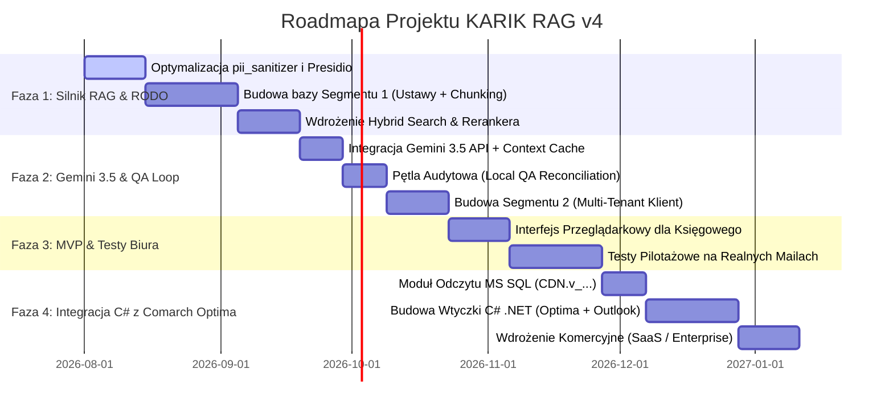

# Specyfikacja Architektoniczna i Roadmapa Wdrożenia
## Tytuł Projektu: Hybrydowy, Skonteneryzowany Moduł RAG Podatkowo-Księgowego z Warstwą Izolacji RODO, Gemini 3.5 Context Caching i Integracją z Comarch ERP Optima (Wersja v4)

---

## 1. Wstęp i Założenia Biznesowe

Niniejszy dokument definiuje docelową architekturę oraz plan wdrożenia (Roadmapę) dla zaawansowanego modułu RAG (Retrieval-Augmented Generation) w ramach systemu **KARIK**.

Głównym celem systemu jest automatyzacja obsługi zapytań księgowych oraz analizy wiadomości E-mail od klientów biura rachunkowego. Moduł zastępuje ręczne przeszukiwanie ustaw i interpretacji KIS/MF automatycznym, bezpiecznym potokiem analitycznym przy jednoczesnym zachowaniu bezkompromisowej ochrony danych osobowych (RODO Zero-Trust).

### Kluczowe wyróżniki architektury v4:
1. **Dwusegmentowy Silnik RAG**:
   * **Segment 1 (Prawo)**: Baza ustaw, rozporządzeń i interpretacji KIS z filtracją czasową (*Time-Aware RAG*) oraz podziałem po całych artykułach.
   * **Segment 2 (Dane Klientów)**: Izolowana przestrzeń wektorowa per klient (*Multi-Tenant Vector Storage*) zawierająca historię księgową, plany kont i transakcje.
2. **Zero-Trust Cloud Architecture**: PII (imiona, nazwiska, NIP, PESEL, kwoty) ulegają lokalnej anonimizacji kontekstowej (*Presidio + GPU llama-server*) przed wysyłką do chmury.
3. **Gemini 3.5 + Context Caching**: Odpytywanie gigantycznych kontekstów prawnych przy redukcji kosztów tokenów o 75% i czasie odpowiedzi < 2 sekundy.
4. **Strict Grounding & QA Reconciliation Loop**: Eliminacja halucynacji prawnych – system wymusza podawanie dokładnych sygnatur i odnośników do ustaw, weryfikowanych przez lokalny model audytujący.
5. **Dedykowana Integracja C# z Comarch ERP Optima & MS Outlook**: Integracja z najpopularniejszym systemem ERP w Polsce poprzez wtyczkę C# (.NET 8) i bezpośredni odczyt MS SQL.

---

## 2. Architektura Systemu i Przepływ Danych (Data Flow Matrix)

```
[ Klient / E-mail / Optima Add-in ]
                │
                ▼ (Treść zapytania / maila)
┌────────────────────────────────────────────────────────────────────────┐
│ KROK 1: Lokalna Anonimizacja RODO (pii_sanitizer.py + llama-server)     │
│ - Presidio Engine (wzorce NIP/PESEL/IBAN + walidatory matematyczne)    │
│ - Smart Masking (zastąpienie podmiotów tokenami kontekstowymi)        │
│ - Zapis słownika de-anonimizacji w Redis RAM (TTL = 600s)              │
└───────────────────────────────────┬────────────────────────────────────┘
                                    │ (Zanonimizowany tekst)
                                    ▼
┌────────────────────────────────────────────────────────────────────────┐
│ KROK 2: Dwu-Segmentowy Silnik RAG                                      │
│                                                                        │
│  ┌─────────────────────────────────┐   ┌────────────────────────────┐  │
│  │ Segment 1: Prawo Podatkowe      │   │ Segment 2: Dane Klienta    │  │
│  │ - Time-Aware (np. rok 2026)     │   │ - Multi-Tenant (client_id) │  │
│  │ - Hybrid Search (BM25 + Dense)  │   │ - Wektorowa historia KPiR  │  │
│  │ - Article-Level Chunking        │   │ - Słownik kontrahentów     │  │
│  └────────────────┬────────────────┘   └──────────────┬─────────────┘  │
│                   │                                   │                │
│                   └─────────────────┬─────────────────┘                │
│                                     ▼                                  │
│              [ Cross-Encoder Reranker (Score > 0.70) ]                 │
│              - If Score < 0.70 -> FALLBACK ("Brak danych")             │
└───────────────────────────────────┬────────────────────────────────────┘
                                    │ (Wyselekcjonowane Artykuły + Kontekst)
                                    ▼
┌────────────────────────────────────────────────────────────────────────┐
│ KROK 3: Synteza Chmurowa (Google Gemini 3.5 API)                       │
│ - Context Caching (zbuforowane ustawy w API Google)                    │
│ - Strict Grounding Prompt (zakaz cytowania spoza dostarczonego tekstu) │
│ - Wynik: Ustrukturyzowany obiekt JSON (cytaty, sygnatury, ryzyko)      │
└───────────────────────────────────┬────────────────────────────────────┘
                                    │ (Kandydacki JSON)
                                    ▼
┌────────────────────────────────────────────────────────────────────────┐
│ KROK 4: Lokalna Audytowalność & Detokenizacja                          │
│ - Local QA Check: Weryfikacja spójności sygnatur z bazą RAG            │
│ - Detokenizator: Przywrócenie pierwotnych danych z Redis RAM           │
└───────────────────────────────────┬────────────────────────────────────┘
                                    │
                                    ▼
┌────────────────────────────────────────────────────────────────────────┐
│ KROK 5: UI Księgowego (Wtyczka C# w Comarch Optima / MS Outlook)       │
│ - Gotowy szkic maila do klienta                                        │
│ - Hiperłącza do aktów prawnych i interpretacji KIS                     │
│ - Wskaźnik Ryzyka (Niski / Średni / Wysoki) + Przycisk "Zatwierdź"     │
└───────────────────────────────────┬────────────────────────────────────┘
```

---

## 3. Szczegółowe Komponenty Techniczne

### 3.1. Segment 1: Baza Prawna (Prawo Podatkowe i Interpretacje)
* **Strategia Chunkowania**: Zaniechanie mikro-chunków (500 tokenów) na rzecz **Granularności Artykułowej (Article-Level Chunking)**. Każdy artykuł ustawy (np. *Art. 22 ustawy o PIT*) stanowi odrębną jednostkę wraz ze wszystkimi jego ustępami i punktami.
* **Metadane Wektorowe**:
  ```json
  {
    "akt_prawny": "Ustawa o podatku dochodowym od osób fizycznych",
    "artykuł": "23",
    "ustęp": "1",
    "obowiązuje_od": "1991-07-26",
    "obowiązuje_do": null,
    "status": "OBOWIĄZUJĄCY",
    "rok_podatkowy": 2026
  }
  ```
* **Query Rewriter**: Moduł przekształcający slang z maila klienta (np. *"kupiłem auto na żonę"*) na język pojęć ustawowych (np. `"użyczenie pojazdu" AND "podmiot powiązany" AND "eksploatacja samochodu osobowego"`).

### 3.2. Segment 2: Baza Klienta (Multi-Tenant Vector Store)
* **Ścisła Izolacja**: Przechowywanie danych w bazie wektorowej (np. Qdrant / pgvector) z wymuszonym filtrem RLS / metadata: `tenant_id == current_client_id`.
* **Smart Context Preservation**: Zastępowanie danych identyfikacyjnych tokenami z zachowaniem branży (`[KONTRAHENT_BRANZA_MOTORYZACYJNA_1]`) oraz relacji prawno-osobowych (`[PODMIOT_POWIĄZANY_RODZINA]`).

### 3.3. Integracja z Comarch ERP Optima (Warstwa C# / .NET)
* **Odczyt Danych (Read-Only MS SQL)**: Bezpośrednie zapytania SQL w trybie `NOLOCK` do widoków Optimy:
  * `CDN.KntKarty` (kontrahenci),
  * `CDN.DokEwidencja` (zapisy KPiR/ryczałt),
  * `CDN.VatNag` / `CDN.VatElem` (rejestry VAT).
* **UI Dodatku (.NET 8 / WPF)**: Dedykowana wtyczka wbudowywana do menu Optimy w tabeli `CDN.MenuFunkcje` oraz niezależny dodatek do Microsoft Outlooka.

---

## 4. Roadmapa Wdrożeniowa (Plan Działań Krok po Kroku)



### Krok 1: Faza Podstawowa (Silnik RAG i RODO)
* **Cel**: Przygotowanie czystego potoku RAG w Pythonie dla Segmentu 1 (Prawo Podatkowe).
* **Zadania**:
  1. Skonfigurowanie podziału ustaw podatkowych (PIT, VAT, CIT, Ordynacja) po pełnych artykułach.
  2. Wdrożenie wyszukiwania hybrydowego (BM25 leksykalne + Dense Vectors).
  3. Integracja **Cross-Encoder Rerankera** z progiem trafności 0.70.
  4. Rozbudowa `pii_sanitizer.py` o Smart Context Preservation.

### Krok 2: Faza Gemini 3.5 & Pętla Jakościowa (QA)
* **Cel**: Połączenie RAG z chmurą przy minimalizacji kosztów i braku halucynacji.
* **Zadania**:
  1. Konfiguracja **Gemini 3.5 Context Caching** dla bazy ustaw podatkowych.
  2. Implementacja prompty z zasadą **Strict Grounding Rules**.
  3. Wykorzystanie lokalnego `llama-server` do weryfikacji sygnatur i zanonimizowanych danych.
  4. Stworzenie bazy wektorowej dla Segmentu 2 (Dane Klientów) z filtrem `tenant_id`.

### Krok 3: Faza Testów Biurowych (MVP Web)
* **Cel**: Weryfikacja systemu przez księgowych w środowisku testowym.
* **Zadania**:
  1. Przygotowanie prostego panelu webowego (FastAPI + HTML/JS UI).
  2. Testowanie na historycznych, trudnych zapytaniach mailowych od klientów.
  3. Kalibracja wag rerankera i promptów weryfikacyjnych.

### Krok 4: Faza Integracji C# z Comarch ERP Optima & Outlook
* **Cel**: Stworzenie komercyjnej wtyczki gotowej do sprzedaży na polskim rynku.
* **Zadania**:
  1. Napisanie biblioteki C# (.NET 8) realizującej bezpieczny odczyt z bazy MS SQL Optimy (`CDN.v_...`).
  2. Stworzenie okna bocznego w WPF/WinUI do wbudowania w menu Optimy.
  3. Zbudowanie dodatku do Microsoft Outlooka (Outlook Add-in) umożliwiającego analizę maila jednym kliknięciem.
  4. **Finałowe Pakietowanie Kontenerowe (100% Docker Compose)**: Pełna konteneryzacja całego stosu (Streamlit UI na porcie 8501, Serwer Ustaw na porcie 8085, FastAPI Gateway, Worker Celery, Local AI Gemma SLM, Postgres pgvector, Redis) z podmontowaniem wolumenów w czasie rzeczywistym (`volumes: - .:/app`), bez konieczności używania `.venv` na Windowsie.


---

## 5. Podsumowanie Wdrożeniowe

Zaproponowana architektura v4 łączy wydajność i bogaty ekosystem AI Pythona z rynkowym standardem integracyjnym C# w Polsce. Dzięki zastosowaniu **Context Caching w Gemini 3.5**, **Strict Grounding Rules** oraz **dwustopniowemu wyszukiwaniu leksykalno-wektorowemu**, moduł RAG staje się bezpiecznym, precyzyjnym i niezwykle tanim w utrzymaniu asystentem księgowego.
